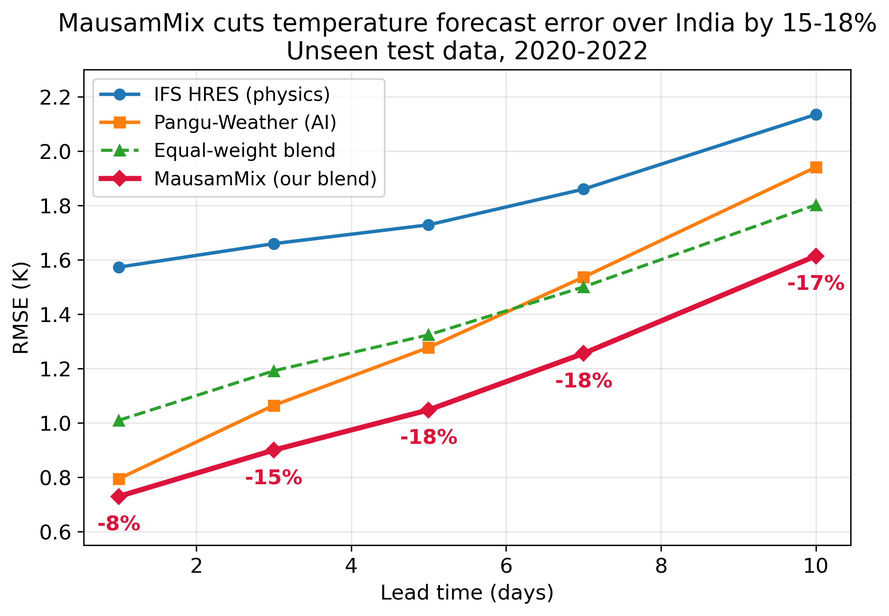
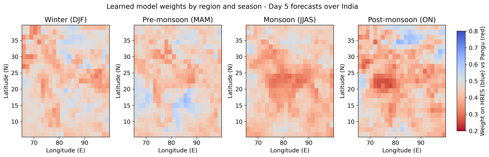
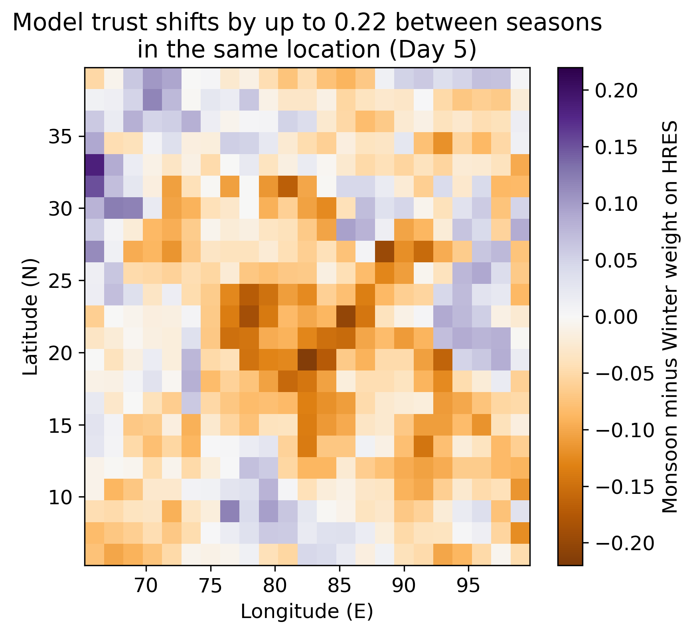
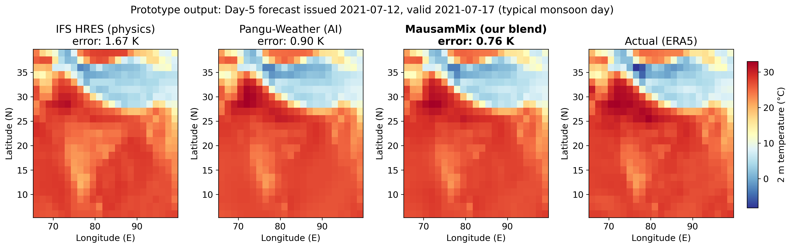
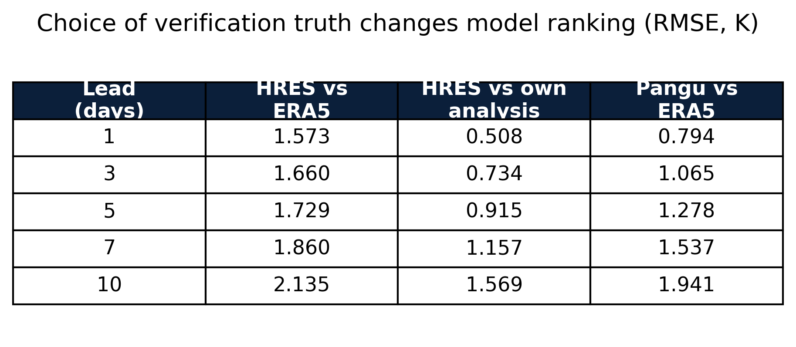

# MausamMix 
### Adaptive blending of AI and physics weather forecasts for India

**Smart India Hackathon 2026 · SIH26081 · Ministry of Earth Sciences**
*Hybrid AI–NWP Multi-Model Forecast Blending System*

---

## The problem

India's forecasters compare several weather models every day — physics-based models like ECMWF's IFS and AI models like Pangu-Weather. Each performs differently by **region, season, lead time and weather regime**, and today the choice of which model to trust is made manually.

MausamMix learns each model's recent skill for every grid cell and lead time, removes each model's recent bias, and blends them adaptively into a single forecast that is more accurate than any individual model.

## Key result

**Adaptive bias-corrected blending cuts 2 m temperature RMSE over India by 15–18% at Days 3–10 compared with the best individual model**, on unseen test data (2020–2022).

| Lead (days) | IFS HRES | Pangu-Weather | Equal blend | **MausamMix** | **Gain vs best** |
|:-:|:-:|:-:|:-:|:-:|:-:|
| 1  | 1.573 | 0.794 | 1.010 | **0.730** | **8.2%**  |
| 3  | 1.660 | 1.065 | 1.192 | **0.900** | **15.5%** |
| 5  | 1.729 | 1.278 | 1.324 | **1.048** | **18.0%** |
| 7  | 1.860 | 1.537 | 1.500 | **1.256** | **18.3%** |
| 10 | 2.135 | 1.941 | 1.802 | **1.615** | **16.8%** |

*RMSE in Kelvin, latitude-weighted, verified against ERA5.*

## What the system learns

The system learns strong **regional** preferences — trusting the AI model up to ~80% over central India during the monsoon, while shifting weight toward the physics model over parts of the Himalayan belt.

In the same location, model trust shifts by up to **0.22 between seasons** — something a single fixed weight cannot capture.

## Prototype output

A Day-5 forecast for a **typical** monsoon day, chosen as the median-improvement day rather than the best day.

## Method

1. **Data:** forecasts from IFS HRES (physics) and Pangu-Weather (AI), with ERA5 as ground truth, from WeatherBench 2. India domain (5–40°N, 65–100°E), 1.5° grid, 00 UTC runs, 2018–2022.
2. **Bias correction:** subtract each model's mean error over the previous 30 days, per grid cell and lead time.
3. **Skill weighting:** weight each bias-corrected model by the inverse of its recent mean squared error.
4. **Blend:** combine the models using the learned weights.
5. **Verification:** design choices tuned on 2018–2019; all results reported only on 2020–2022.

### No future information is used
For a forecast issued on day *t* at lead *L*, bias and skill are computed only from forecasts issued on or before *t − L − 1*, whose outcomes were already known. Weights are undefined for the first 30 days of the record.

### Verification honesty

All models are verified against ERA5 for a common target. Against its own operational analysis, IFS HRES scores considerably better (0.51 K at Day 1), so the choice of reference changes the ranking. An operational deployment would verify each model against the appropriate analysis; the blending method is unchanged.

## How to run

1. Open `notebooks/mausammix_blending.ipynb` in Google Colab.
2. **Runtime → Run all.** If the first cell installs packages, the runtime restarts automatically; click **Run all** once more.
3. Data streams directly from the public WeatherBench 2 bucket — no login needed. Outputs are saved to Google Drive under `sih081/`.

## Repository structure

- `notebooks/` — the complete, runnable pipeline
- `figures/` — all charts and tables used in the presentation
- `results/` — final result tables as CSV

## Roadmap

- [x] Temperature blending with bias correction and adaptive weights
- [x] Regional and seasonal weight maps
- [x] Leakage-free verification on unseen years
- [ ] Rainfall blending verified against IMD 0.25° gridded rainfall
- [ ] Extreme-weather guidance (heavy rain, heat waves) via probability blending
- [ ] Weather-regime-conditioned weights
- [ ] Additional members: IFS ensemble mean, GraphCast
- [ ] Daily operational script and forecaster dashboard

## Data and references

- Rasp et al. (2024), *WeatherBench 2: A benchmark for the next generation of data-driven global weather models* — [paper](https://arxiv.org/abs/2308.15560) · [data guide](https://weatherbench2.readthedocs.io/en/latest/data-guide.html)
- Hersbach et al. (2020), *The ERA5 global reanalysis*, Quarterly Journal of the Royal Meteorological Society
- Bi et al. (2023), *Accurate medium-range global weather forecasting with 3D neural networks* (Pangu-Weather), Nature
- Pai et al. (2014), IMD 0.25° gridded rainfall dataset, MAUSAM — [IMD Pune](https://www.imdpune.gov.in/cmpg/Griddata/Rainfall_25_NetCDF.html)
